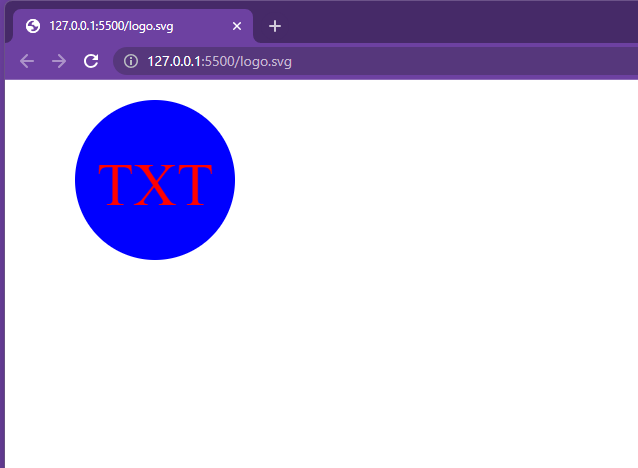

# Logo Maker

## Description
A simple and easy way for users to create a basic logo by selecting the text (up to three characters), color of text, shape and color of shape that they would like their logo to be. 

## Installation/Usage
User will run "npm i", then "node index.js", then answer the prompts by typing in a response or using the arrow keys to make a selection

## Example
Here is a screenshot of a completed logo  

## Contributors
Stephanie Jauch and Meg Meyers (TA)

## GitHub

To view the GitHub repo, you can visit (https://github.com/SKJauch/logo-maker)

## Video

To view the walkthrough video, please click the following link: [Video](https://drive.google.com/file/d/1wFfCLCa0kkCUmANJgjnNs3feXSRYJ36M/view)
